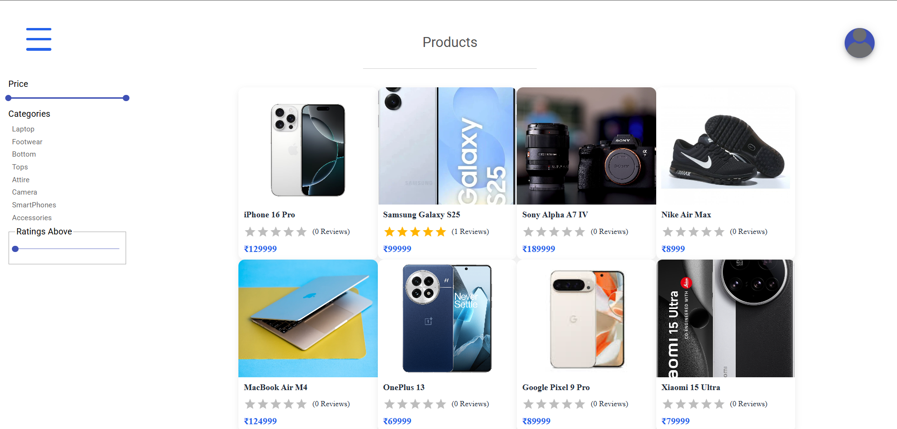
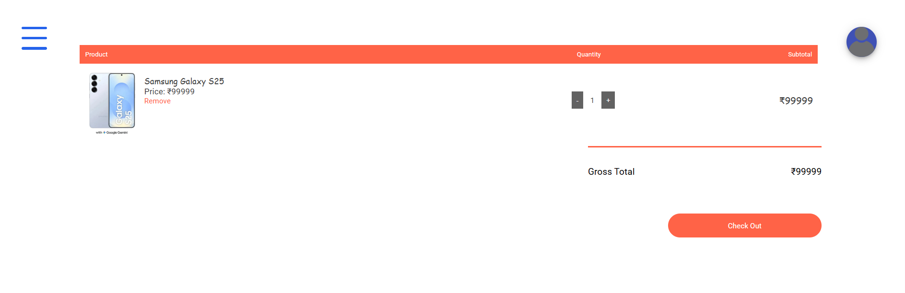
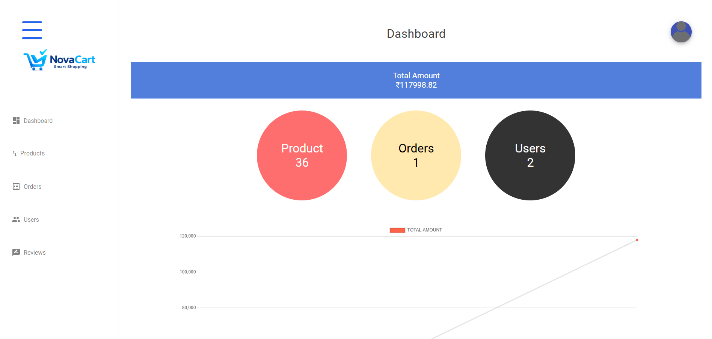

# NovaCart

Live Demo: https://novacart-frontend.onrender.com

A full-stack MERN E-Commerce platform featuring:
- User Authentication
- Product Management
- Shopping Cart
- Order Tracking
- Payment Integration
- Admin Dashboard
- Responsive Design

NovaCart is a full-stack MERN E-Commerce web application that provides a complete online shopping experience for customers and an admin dashboard for store management.

## 🚀 Features

### User Features
- User Registration & Login
- JWT Authentication
- Forgot Password & Reset Password
- Product Search
- Product Filtering by Category, Price, and Ratings
- Product Details Page
- Add to Cart
- Shipping Information
- Cash on Delivery (COD) Order Placement
- Order History
- User Profile Management
- Product Reviews & Ratings

### Admin Features
- Admin Dashboard
- Product Management
  - Add Product
  - Update Product
  - Delete Product
- Order Management
- User Management
- Review Management
- Sales Analytics Dashboard

---

## 🛠 Tech Stack

### Frontend
- React.js
- Redux
- React Router
- Material UI
- Chart.js

### Backend
- Node.js
- Express.js
- MongoDB
- Mongoose
- JWT Authentication
- Cloudinary

---

## 📂 Project Structure

```
NovaCart/
│
├── backend/
│   ├── controllers/
│   ├── middleware/
│   ├── models/
│   ├── routes/
│   ├── utils/
│   └── server.js
│
├── frontend/
│   ├── public/
│   ├── src/
│   │   ├── actions/
│   │   ├── reducers/
│   │   ├── component/
│   │   └── App.js
│
├── package.json
└── README.md
```

---

## ⚙️ Installation

### Clone Repository

```bash
git clone https://github.com/singhshreya18/NovaCart.git
cd NovaCart
```

### Install Backend Dependencies

```bash
npm install
```

### Install Frontend Dependencies

```bash
cd frontend
npm install
```

---

## 🔐 Environment Variables

Create a file:

```bash
backend/config/config.env
```

Add the following variables:

```env
PORT=4000

DB_URI=your_mongodb_connection_string

JWT_SECRET=your_jwt_secret
JWT_EXPIRE=7d

COOKIE_EXPIRE=7

CLOUDINARY_NAME=your_cloudinary_name
CLOUDINARY_API_KEY=your_cloudinary_api_key
CLOUDINARY_API_SECRET=your_cloudinary_api_secret
```

---

## ▶️ Run Application

### Backend

```bash
npm run dev
```

### Frontend

```bash
cd frontend
npm start
```

Application will run at:

```text
Frontend: http://localhost:3000
Backend:  http://localhost:4000
```

---

## 📸 Screenshots

### Home Page
- Product Listings
- Search Functionality
- Category Filters

### Product Details
- Product Information
- Reviews & Ratings

### Cart & Checkout
- Shipping Information
- Order Summary
- Cash on Delivery

### Admin Dashboard
- Product Management
- Order Management
- User Management
- Analytics

---

## 📈 Future Enhancements

- Online Payment Gateway Integration
- Wishlist Functionality
- Coupon & Discount System
- Email Notifications
- Mobile Application

---

## 📸 Project Screenshots

### Home Page


### Products Page


### Shopping Cart


### Admin Dashboard


### Additional Screenshot 1
.png)

### Additional Screenshot 2
.png)

### Additional Screenshot 3
.png)

## 👩‍💻 Developed By

### Shreya Singh
GitHub: https://github.com/singhshreya18

### Shreya Singh
LinkedIn: https://www.linkedin.com/in/shreya-singh-429b39251/

---

## 📄 License

This project is developed for educational and learning purposes.
